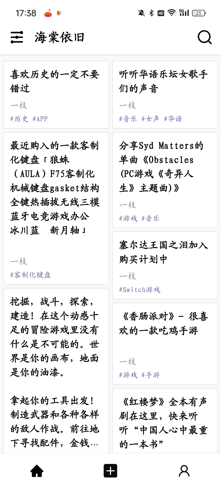
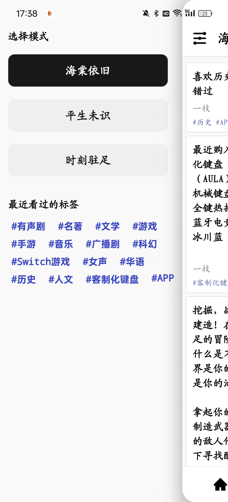
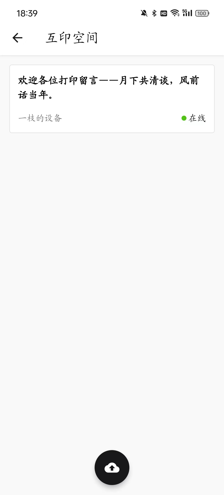
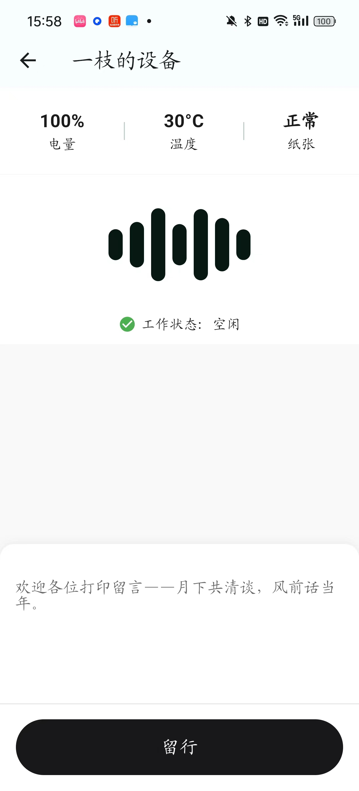

<h1 align="center">
  一枝
</h1>

> 名字取自阅尽好花千万树，愿君记取此一枝。
项目主要为个人学习项目，他的主要功能是分享网页链接，你也可以在查看内容的同时和其他人一起交流，另外还增加了和打印设备交互的功能，你可以在发布的内容里挖掘隐藏信息

## 预览

部分页面效果如下：

|     |      |    |     |
| :--------------------------------: | :---------------------------------: | :-------------------------------: | :-------------------------------:

下图是app和硬件交互

Android版安装包：[点击去下载](https://www.pgyer.com/K6uJ3U)。

## 互印空间
一个用户之间可以通过设备互相打印留言的功能。目前功能还未完善，项目中也还有诸多不足的地方，后续会不定时更新，如果对本项目感兴趣的可以留言联系本人，欢迎各位大佬指点。
|     |      | 
| :--------------------------------: | :---------------------------------: 

### 作者水平有限代码仅供参考，初学者多多去看优秀项目，以下是作者开发过程中使用的开源项目

管理框架使用的是cool-admin：https://www.cool-js.com/

flutter参考主要参考了https://github.com/simplezhli/flutter_deer/tree/master和https://github.com/phoenixsky/fun_android_flutter这两个

硬件设备来源b站小智学长的付费课程https://www.bilibili.com/cheese/play/ss5058?csource=Hp_searchresult&spm_id_from=333.337.0.0
